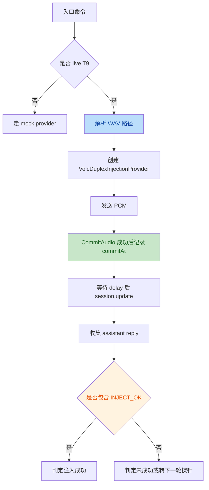

# B14 火山集成审查修复说明

## 背景

本轮审查聚焦 `fluentwork-backend` 最近与火山云集成相关的改动，范围包含：

- 豆包语音 duplex realtime smoke
- 方舟 endpoint smoke
- B14 T3/T4/T9 注入验证 harness

审查目标不是判断“是否已经可用”，而是判断“当前证据链是否可信、入口是否可执行、指标是否语义正确”。

## 问题清单

### 1. live T9 入口缺少 WAV 路径，运行即失败

**现象**

`cmd/poc-injection-window` 在启用 `VOLC_POC_LIVE_T9=1` 时，会走 live provider，但构造 `VolcDuplexInjectionProvider` 时没有传 `WavPath`。

provider 内部要求 `WavPath` 必填，因此首个 trial 就会直接报错。

**根因**

- 入口命令和 provider 契约脱节
- 默认夹具路径只在 `cmd/smoke-volc-realtime` 内部维护，未复用到 `poc-injection-window`

**修复**

- 抽出共享 helper：`voicepoc.DefaultFixtureWAVPath()`
- `cmd/poc-injection-window` 新增 `resolveWavPath()`
- 支持 `VOLC_POC_WAV` 覆盖，默认落到共享夹具

### 2. 注入成功判定过宽，存在假阳性

**现象**

`scoreInjectReply` 原本只要满足：

- `HitMarker`
- 或 `HitTopic && HitConfirm`

就会被判为注入成功。

但默认音频夹具本身就是 `cache invalidation` 主题，因此模型在**没有被注入影响**时，也可能仅因正常复述用户内容而命中：

- `HitTopic`
- `HitConfirm`

从而被误判为注入成功。

**根因**

- 把“话题复述”误当成“注入生效证据”
- 判定器没有把“显式 marker”当作强证据与唯一证据

**修复**

- 将 `scoreInjectReply().OK` 收紧为：**必须出现 `INJECT_OK`**
- 保留 `HitTopic` / `HitConfirm` 作为诊断字段，但不再作为成功条件

### 3. `ModelStartAfterMS` 计时起点错误

**现象**

`VolcDuplexInjectionProvider.RunDelayedInject()` 原本在 `SendPCM()` 之前记录 `commitAt := time.Now()`，导致 `ModelStartAfterMS` 包含了整段音频上传时间。

这与字段语义“commit 后 / VAD-stop 后模型何时开始进入处理”不一致。

**根因**

- 时序观测点放错位置
- 指标命名与采样点没有对齐

**修复**

- 将 `commitAt` 记录点后移到 `CommitAudio()` 成功之后
- 让 `ModelStartAfterMS` 真正代表 commit 后的相对时序

## 流程描述



## 修复后的门禁设计

### 代码门禁

至少执行以下测试：

```bash
go test ./cmd/poc-injection-window ./internal/voicepoc
```

覆盖点：

- `resolveWavPath()` 默认路径与 env 覆盖
- `scoreInjectReply()` 必须带 marker 才算成功
- 现有 `voicepoc` 统计与 WAV 读取测试

### 运行门禁

本地 live 验证按以下顺序执行：

```bash
./scripts/smoke-volc-speech-creds.sh
./scripts/smoke-volc-ark.sh
./scripts/smoke-volc-realtime.sh
./scripts/smoke-volc-realtime.sh --asr
./scripts/smoke-volc-realtime.sh --inject
./scripts/smoke-volc-realtime.sh --t9
```

### 判定门禁

- `--inject` / `--t9` 的“成功”必须依赖显式 `INJECT_OK`
- 仅出现 `cache invalidation` / `缓存失效` 相关复述，不再计为注入成功
- `ModelStartAfterMS` 只作为观测指标，不参与当前 tier 直接决策

## 本次落地文件

- `cmd/poc-injection-window/main.go`
- `cmd/poc-injection-window/main_test.go`
- `cmd/smoke-volc-realtime/main.go`
- `internal/voicepoc/wav.go`
- `internal/voicepoc/volc_duplex.go`
- `internal/voicepoc/volc_provider.go`
- `internal/voicepoc/inject_score_test.go`

## 后续约束

后续凡是涉及 vendor probe / smoke / 判定器：

1. 入口命令必须复用共享默认夹具或显式要求输入
2. 判定器必须优先使用不可歧义 marker
3. 时序指标命名必须和采样点一一对应
4. live 证据与 mock 证据必须分开标注，不可混算
