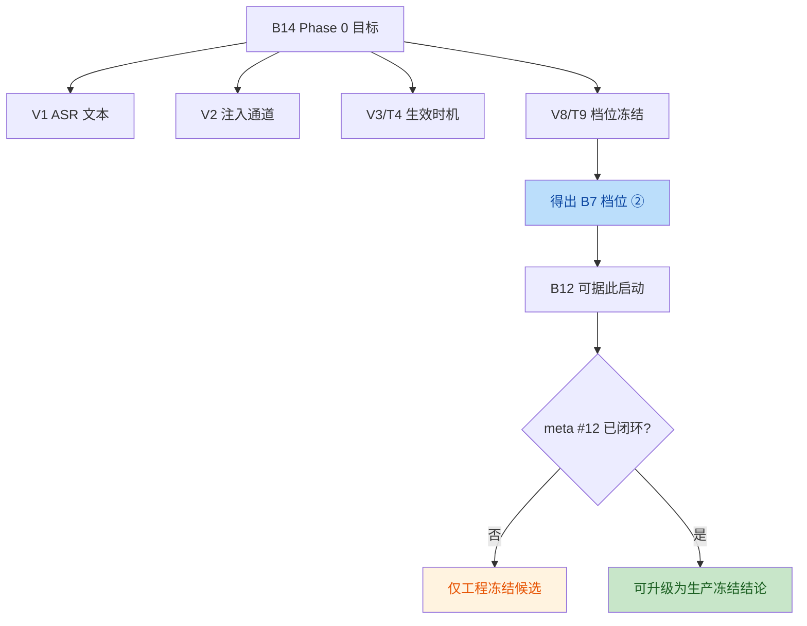

# B7 / B14 设计与测试完备性核查报告

## 结论

本次检查结论分两层：

1. **对本次修复改动本身**：可以提交。
2. **对 B7 / B14 整体能力**：只能认定为 **Phase 0 设计闭环 + 工程冻结候选成立**，**不能认定为完整生产闭环**。

原因不是代码没法运行，而是仓内现有文档明确写明：

- `B14` 的档位结论是 `B12` 启动门禁，不等于 `B12/B7` 已经全部实现
- `meta #12`（额度 / 不训练 / 并发）未闭环前，结果只能算工程冻结候选，不能升级为生产冻结

## 一、设计是否已经存在

答案：**存在，且在 backend 仓内已经形成连续文档链。**

设计证据：

- `docs/02_第二波开发范围与任务清单.md`
- `docs/04_B14_注入POC执行清单.md`
- `docs/06_B14_D2_duplex实现说明.md`
- `docs/07_B14_D3_ASR实现说明.md`
- `docs/08_B14_T3T4_注入生效实现说明.md`
- `docs/09_B14_T9_注入窗口实现说明.md`

其中已经明确回答了 4 个关键问题：

1. `B14` 为什么先做：它是 `B12` / `B7` 命中反馈链路的启动前提
2. 注入能力验证什么：V1 / V2 / V3 / V8
3. B7 产品形态如何落：当前档位结论偏向 **② next-turn open confirm**
4. 什么情况下才能算冻结：需要 `meta #12` 闭环，且必要时补大样本 T9

## 二、设计是否闭环

答案：**对 Phase 0 来说闭环；对生产落地来说未闭环。**



### 已闭环部分

- B14 的供应商探针目标明确
- duplex / ASR / inject / T9 的验证路径明确
- B7 的产品降级形态有结论：**下一用户话轮开场确认**

### 未闭环部分

- `meta #12` 商务与供应商前置未在本仓闭环
- `B12` 真正的命中检测路径尚未在本仓完成
- live T9 当前仍以现有夹具和样本量作为工程证据，不是法务/生产最终冻结

## 三、本次改动对应的功能内容是否设计清楚

答案：**清楚。**

本次修复针对的是 3 个具体工程缺口，不是新增业务方案：

1. live T9 入口缺少 WAV 路径
2. 注入成功判定过宽，证据标准失真
3. `ModelStartAfterMS` 指标语义偏移

这 3 个问题都属于“实现偏离既有设计”，不是“设计本身缺失”。

也就是说，本次改动是在把代码重新拉回已有设计约束：

- probe 入口必须可执行
- 注入成功证据必须不可歧义
- 时序指标必须与命名一致

## 四、测试是否完备

答案：**对本次修复范围来说基本完备；对 B7 / B14 整体 live 验证来说仍有外部依赖门禁。**

### 1. 已覆盖的测试

本次已通过：

```bash
go test ./...
```

覆盖到：

- `cmd/poc-injection-window` 默认夹具与 env 覆盖
- `internal/voicepoc` 的窗口统计
- `scoreInjectReply` 新规则
- WAV 读取
- backend 其余已有 Go 单测/集成测试

### 2. 已补上的关键断言

- 话题复述不再被视为注入成功
- 显式 `INJECT_OK` 才能视为注入成功
- live T9 provider 必须拿到 WAV 路径

### 3. 仍未在本地自动化内闭合的部分

这些不是本次修复遗漏，而是天生依赖外部环境：

- 火山 live 凭据
- 代理网络
- 真实供应商行为稳定性
- 更大样本量 T9 复测

因此，本仓能做到的门禁应分成两层：

1. **代码门禁**：`go test ./...`
2. **运行门禁**：`smoke-volc-speech-creds` / `smoke-volc-ark` / `smoke-volc-realtime --asr|--inject|--t9`

## 五、最终判断

### 可以确认通过的部分

- 本次修复改动具备明确设计依据
- 本次修复改动的测试覆盖达到可提交标准
- backend 当前代码状态可进行提交

### 不能夸大宣称通过的部分

- 不能说 `B7` 已完整交付
- 不能说 `B14` 已完成生产冻结
- 不能说供应商前置、并发、法务口径已经在本仓闭环

## 六、提交策略

本次提交应被定义为：

**修复 B14 火山验证链路中的工程性偏差，并补齐核查报告与门禁说明。**

不应被定义为：

- “完成 B7”
- “完成 B14 全量交付”
- “完成生产冻结”

## 七、建议的提交后状态标记

提交后建议对外口径统一为：

1. `B14`：Phase 0 工程冻结候选成立，当前结论仍为档位 **②**
2. `B7`：产品形态与注入结论已具备设计前提，但功能实现仍以后续 `B12` 为准
3. 本次修复：已把 probe 入口、证据判定、时序指标拉回到设计约束内
