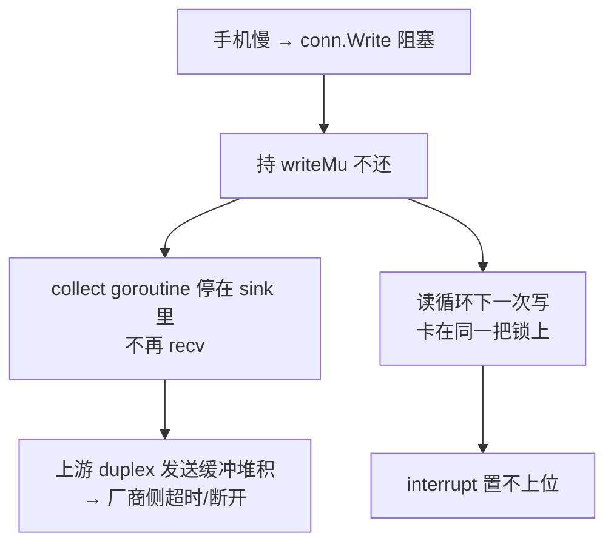

# 写路径有界：一次写不能无限期阻塞

**日期**：2026-09-12
**状态**：实现与测试已齐。
**关联**：meta `99_WSS系列_18_轮次归属_顺序标识与三条时钟.md` §⑪（优化路径第一步）· backend `docs/66`（长 TTS 打断，读循环改成 goroutine 之后暴露的下一层）

---

## 1. 守住的不变量

> **一次 gateway→client 的写必须有界。** 它不得无限期阻塞，也不得在阻塞时把同一条连接上的其他写挡在门外。

这条不是"性能优化"。它是 `docs/66` 把 `collectTurn` 挪进 goroutine 之后，**唯一还能重建同一个失效的路径** —— 只是路径从直接变成了通过锁。

---

## 2. 根因

三件事叠在一起：

| # | 事实 | 位置 |
|---|---|---|
| 1 | `sendJSON` 与 `sendOutbound` 共用一把 `writeMu` | `handler.go:312` / `:318` 附近 |
| 2 | `conn.Write` 用的是 **session ctx** —— 没有 deadline | `writeProviderOutbound` → `conn.Write(ctx, ...)` |
| 3 | sink 是**同步**调用，跑在 collect goroutine 上 | `volc_duplex.go:64-66` 要求它 "must not block"，但没有东西保证 |

于是：



### 2.1 为什么 `interrupt` 是这条链上最致命的一处

`interrupt` 分支**无条件**调用 `sendOutbound`：

```go
outbound, err := rt.provider.HandleClientControl(ctx, frameType, data)
if err != nil { ... }
return rt.sendOutbound(ctx, conn, outbound)   // ← 即使 outbound 是 nil
```

而 `sendOutbound` **先取锁、再遍历**。provider 对 `interrupt` 返回的是 `nil, nil`（`provider_volc_duplex.go:585-595`：只置 `interruptedThisTurn` + 打日志）。

**所以一次没有任何内容要写的打断，也会去抢那把被阻塞写持有的锁。** 读循环停在这里，`interruptedThisTurn` 永远置不上 —— **长 TTS 打断重新退化成空操作，正是 `docs/66` 修好的那个症状。**

---

## 3. 修法

`Options.WriteTimeout`（默认 `defaultWriteTimeout = 5s`）→ `Handler.writeTimeout` → `sessionRuntime.writeTimeout`，由 `sendJSON` / `sendOutbound` 在**取到锁之后**套一层 `context.WithTimeout`。

| 决策 | 取值 | 理由 |
|---|---|---|
| 上界从哪来 | 配置 + 零值回退 `defaultWriteTimeout` | 零值不能等于"无上界"；测试与任何直接构造 `sessionRuntime` 的调用方都必须仍然有界 |
| deadline 在锁前还是锁后 | **锁后** | 它约束的是"这次写"，不是"等这把锁"。放在锁前会让一个只是在排队、并没有写坏的调用方去关连接 |
| 超时后做什么 | **关闭整条连接** | 见下 |

### 3.1 超时关连接是**有意的**，不是副作用

`coder/websocket` 的 `setupWriteTimeout` 在 ctx 到期时调用 `c.close()` —— **关的是整条连接，不只是这次写**：

```go
func (c *Conn) setupWriteTimeout(ctx context.Context) {
	stop := context.AfterFunc(ctx, func() {
		c.clearWriteTimeout()
		c.close()
	})
```

这不是一个可以忽略的实现细节，选它是因为它恰好是**对的语义**：

- 语音是实时的。一个几秒钟都吃不进字节的客户端不是"慢"，是**没了**。
- 丢帧保会话会让它**落后于一条永远追不上的流** —— 实时音频没有"追上"这回事，听到的是断句。
- 关连接让 `persistOnExit` 正常记录这一场、并把上游 duplex 干净地拆掉。**而这恰恰是阻塞时做不到的事**（阻塞时上游是被拖死，不是被收尾）。

### 3.2 明确没做

**有界队列 + 单写者 + 丢帧策略。** 它保住会话、只丢音频，但代价是客户端听到破碎句子且无从知晓，同时要新增队列、优先级、丢帧策略与观测。

不做的理由不是"难"，是**没有现场数据支持它**：本轮修的是"写没有上界"，而队列要解决的是"客户端只是慢、并没有死"。等真出现后者再说 —— 届时 `WriteTimeout` 的日志会先给出这个现场。

---

## 4. 测试

**测试名**：`TestSessionRuntime_WriteToStalledClientIsBounded`
（`internal/voicegateway/handler_write_bound_test.go`）

它构造一个**从不读**的 WSS 对端，然后往它写 16 MiB。关键在于：

> **测试不给 `sendOutbound` 传 deadline。** 上界必须来自生产代码 —— 否则这条测试只是在验证 `conn.Write` 会尊重调用方自己设的 ctx，等于什么都没验。

### 4.1 修复前的实际输出

```
=== RUN   TestSessionRuntime_WriteToStalledClientIsBounded
=== PAUSE TestSessionRuntime_WriteToStalledClientIsBounded
=== CONT  TestSessionRuntime_WriteToStalledClientIsBounded
    handler_write_bound_test.go:83: write to a stalled client did not return within 5s —— 写路径没有上界。
        collect goroutine 会一直停在 sink 里不再 recv（上游缓冲堆积），
        读循环下一次写也会卡在同一把 writeMu 上。
--- FAIL: TestSessionRuntime_WriteToStalledClientIsBounded (8.00s)
FAIL
FAIL	github.com/FluentWork/fluentwork-backend/internal/voicegateway	8.018s
FAIL
```

### 4.2 修复后

```
--- PASS: TestSessionRuntime_ZeroWriteTimeoutResolvesToDefault (0.00s)
=== NAME  TestSessionRuntime_WriteToStalledClientIsBounded
    handler_write_bound_test.go:87: 写有界地返回了：failed to write msg: failed to write frame: context deadline exceeded
--- PASS: TestSessionRuntime_WriteToStalledClientIsBounded (0.75s)
PASS
ok  	github.com/FluentWork/fluentwork-backend/internal/voicegateway	0.766s
```

### 4.3 守卫的守卫（改回去，看是哪条红）

把 `sendOutbound` 里的 `context.WithTimeout` 摘掉后：

```
    handler_write_bound_test.go:89: write to a stalled client did not return within 5s —— 写路径没有上界。
        collect goroutine 会一直停在 sink 里不再 recv（上游缓冲堆积），
        读循环下一次写也会卡在同一把 writeMu 上。
--- FAIL: TestSessionRuntime_WriteToStalledClientIsBounded (5.00s)
```

**红的正是预料的那条**，失败信息指向真实原因。

另一条 `TestSessionRuntime_ZeroWriteTimeoutResolvesToDefault` **保持绿** —— 它钉的是另一半（零值回退）。两条测试各咬一半，破坏任一半只红对应那一条。

### 4.4 门禁

`./scripts/dev-check.sh`：gofumpt · goimports · golangci-lint · `go test ./...` · `go build` —— **All checks passed**。

（首轮 lint 抓到 `defer client.CloseNow()` 未检查返回值，已改。）

---

## 5. 遗留

| 项 | 说明 |
|---|---|
| `interrupt` 的空写仍然取锁 | 现在被 `WriteTimeout` 兜住了（最坏等一个 timeout），但"没有内容可写却去抢写锁"本身仍是浪费。与本条独立，可单独改 |
| `sendJSON` 同样加了上界 | 它是读循环的写路径（`pong` / 控制 ack），同理需要 |
| 真机验证 | 本条**未**真机验证。可复现的失败在单测里已经钉住；真机要看的是"手机慢"这个现场是否真的会发生 |
