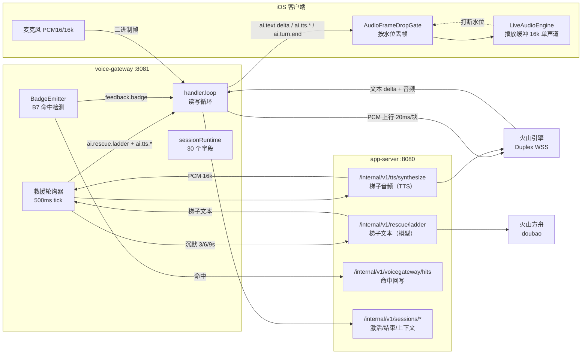
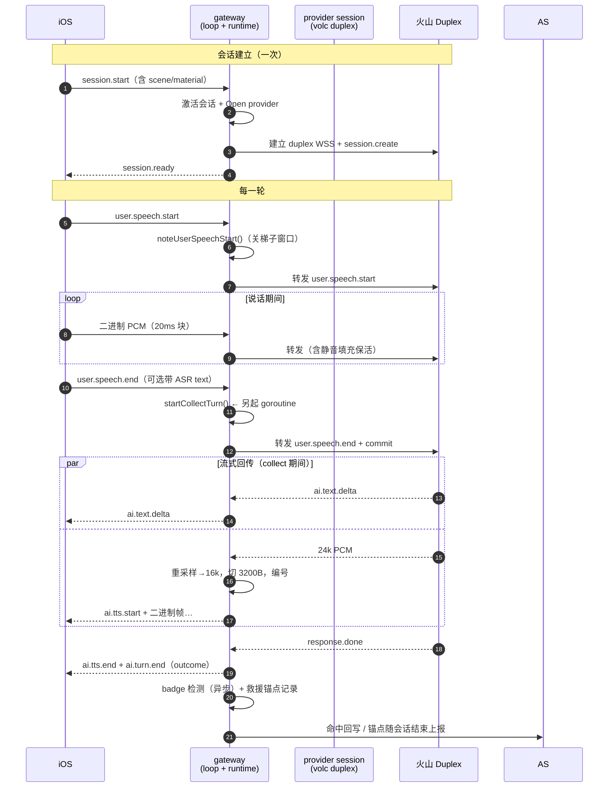
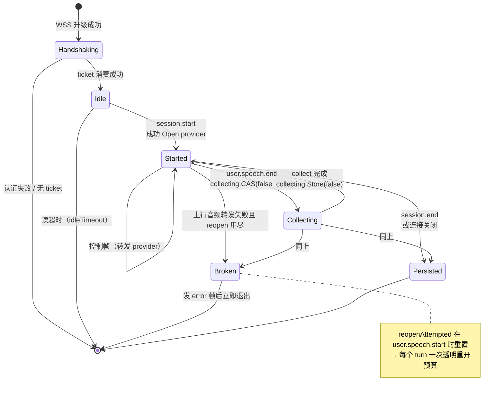
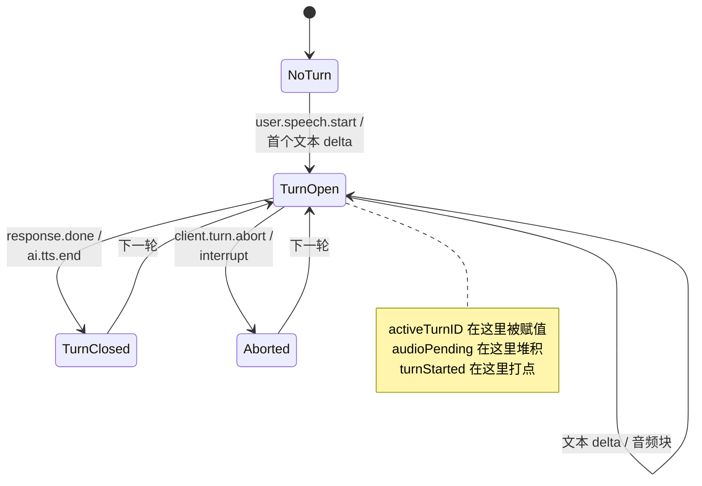
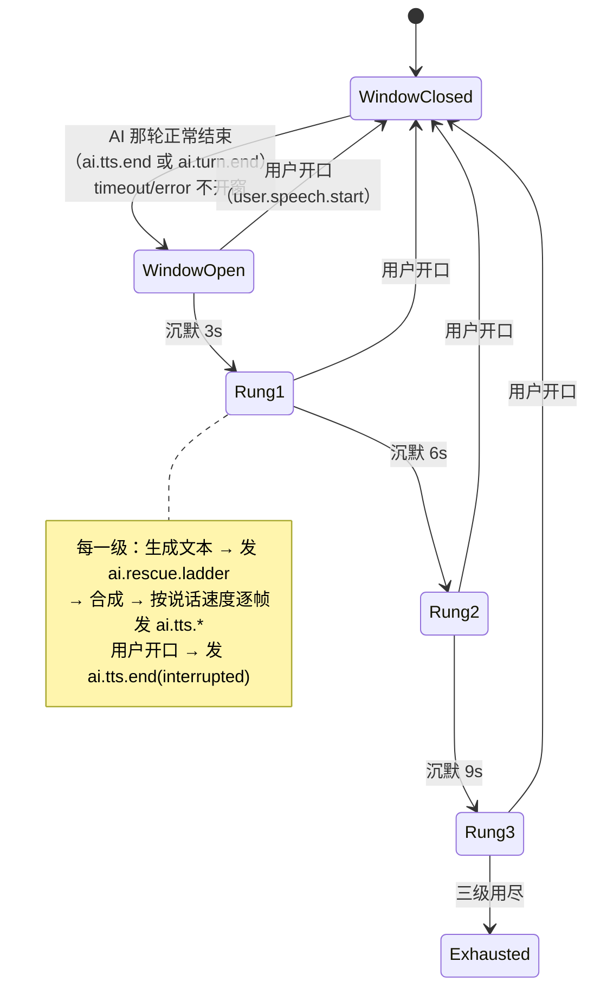

# TTS / WSS 链路图：数据流与状态机（现状）

**日期**：2026-09-18
**目的**：把**现在**是怎么实现的画清楚。与 `94_`（审核报告）配套：那张报告说哪里有问题，这张图说现在的样子。
**状态**：现状快照，不是目标设计。目标设计见 `96_` 起。

图中每一处都对应真实代码，标注了 `文件:行号`。行号以 `main` = `c8f4f66` 为准。

> **后续（2026-09-18 晚）**：M1–M6 已落地，三处符号随之改名/消失，本页已就地更正——
> `audioFrameBytes` / `RescueAudioFrameBytes` 删除（帧长改由 `AudioFormat.FrameBytes` 推导）、
> `pcm16kChunkBytes` 迁到 `internal/voiceduplex`、`voicepoc.DuplexSession` → `voiceduplex.DuplexSession`。
> 三张状态图与帧清单描述的形状**仍然成立**（`sessionRuntime` 的字段、turn 状态散在三处、
> `ai.tts.*` 有两个生产者），只有名字变了。

---

## 一、部署与数据流总览

**一次说话里，音频和文本走的是两条不同的路**：

| 方向 | 载体 | 路径 |
|---|---|---|
| 上行音频 | 二进制帧 | iOS → gateway → 火山（每 20ms 一块，`voiceduplex.pcm16kChunkBytes=640`） |
| 下行 AI 语音 | 二进制帧 | 火山 → gateway（**重采样 24k→16k**）→ iOS（每 100ms 一块，`AudioFormat.FrameBytes(ClientFrameMS)=3200`） |
| 下行控制 | JSON 文本帧 | `ai.text.delta` / `ai.turn.end` / `feedback.badge` / `ai.rescue.ladder` |
| 梯子音频 | 二进制帧 | app-server TTS → gateway → iOS（**复用下行 AI 语音那条路**） |

---

## 二、一轮对话的数据流（时序）

---

## 三、会话状态机（gateway 侧）

`sessionRuntime` 没有显式的状态枚举，状态由若干字段共同表达。这是**现状**，也是 `94_` F1 说的那件事。

**字段与状态的对应**（现状的"状态在哪儿"）：

| 状态 | 由什么表达 |
|---|---|
| 未开始 | `!rt.started` |
| 已开始 | `rt.started == true` |
| collect 中 | `rt.collecting`（`atomic.Bool`） |
| 已损坏 | `rt.broken`（普通 bool，只写一次） |
| 已持久化 | `rt.ended` |
| 重开预算 | `rt.reopenAttempted` |

---

## 四、turn 状态机（provider 侧）

**turn 相关的字段散在三处**：`sessionRuntime`（`rescueTurnID`）、
provider session（`activeTurnID` / `turnStarted` / `audioPending` / `nextAudioSeq`）、
`voiceduplex.DuplexSession`（另一个 `activeTurnID`；当时叫 `voicepoc.DuplexSession`）。

---

## 五、B8 卡壳救援的状态机

轮询器每 500ms tick 一次；`rescueInFlight` 保证同一时刻只有一级在生成
（它是 busy 标志不是锁——只有轮询器这一个 writer）。

---

## 六、帧清单与方向

| 帧 | 方向 | 谁产生 | 备注 |
|---|---|---|---|
| `auth` / `session.ready` | C→S / S→C | gateway | 握手 |
| `session.start` | C→S | iOS | 含 scene/material/续接上下文 |
| `user.speech.start/end` | C→S | iOS | end 可带 ASR 文本 |
| `client.turn.abort` | C→S | iOS | 按住不松手；**不回 error 帧** |
| `interrupt` | C→S | iOS | 打断 AI 说话 |
| `ai.text.delta` | S→C | provider | 真增量 |
| `ai.tts.start` / `ai.tts.audio` / `ai.tts.end` | S→C | provider **和** 救援 | 二进制音频的容器 |
| `ai.turn.end` | S→C | provider | 带 outcome（ok/timeout/error/partial） |
| `ai.rescue.ladder` | S→C | 救援 | **只带文本**，音频走 `ai.tts.*` |
| `feedback.badge` | S→C | BadgeEmitter | B7 命中 |
| `error` | S→C | gateway | 非法 JSON / 已知类型的语义错误 |
| `ping` / `pong` | 双向 | 双方 | 保活 |

**未知 `type` 不发 error**，忽略并计数（`unknownFrameCount`）——为的是将来加帧类型不会打死旧网关。

---

## 七、这张图暴露的三个结构问题

与 `94_` 的发现对应，图本身就看得出来：

1. **两条音频路在 gateway 汇合，但没有共同的表示**：provider 发的是
   `encodeAudioFrame()` 拼的字节，救援发的是 `voiceproto.AITTSAudio.Encode()` 拼的字节
   ——线格式相同，实现两个（`94_` F4）。
2. **`ai.tts.*` 有两个生产者**（provider 与救援），但没有一个"音频流"抽象描述
   "谁在说、说到第几帧、什么时候结束"。序号、切帧、结束帧三件事各写一遍。
3. **turn 的状态在两张图里都有**（会话图的 Collecting、turn 图的 TurnOpen），
   而它们由**不同包的不同字段**表达，没有一处能同时看到两者。
