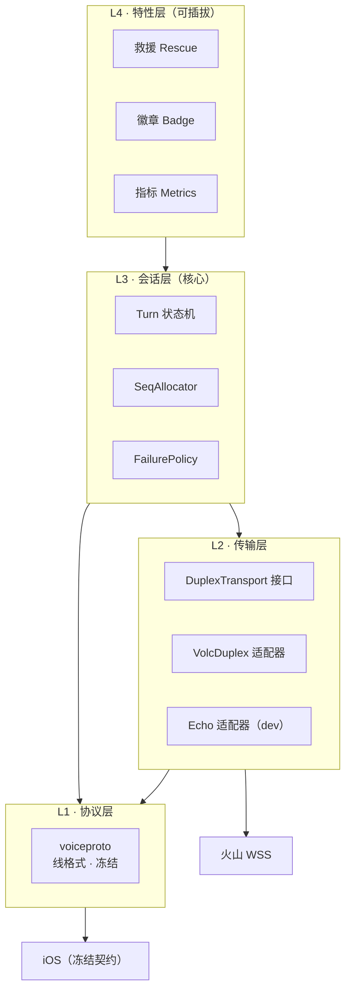

# 语音链路重构设计 0/3：总览与架构

**日期**：2026-09-18
**系列**：`95_`（现状图）→ **`96_`（本文，架构）** → `97_`（接口与状态机）→ `98_`（防水与迁移）
**状态**：设计，**未动代码**。等指令。
**前置**：`94_` 审核报告（问题清单）、`95_` 链路图（现状）

---

## 0. 一句话主张

> **把"谁在说话"变成一个对象，把"说到第几帧"变成一个分配器，把"失败了怎么办"变成一张表。**
> 其余一切照旧——208 个测试、冻结的协议、真机教出来的行为，全部保留。

这不是重写。是**给已经长出来的补丁找一个主结构**（`94_` §四）。

---

## 1. 设计目标与不可协商的约束

| # | 目标 | 含义 |
|---|---|---|
| G1 | **高可用** | 任何单点失败都降级，不级联；用户永远知道"此刻能听到什么" |
| G2 | **高解耦** | 核心逻辑不知道 vendor、不知道帧名、不知道重采样 |
| G3 | **高鲁棒** | 真机踩过的坑在**结构上**不可能重犯，而不是靠注释提醒 |

### 不可协商（先划死，否则设计会飘）

| 约束 | 原因 |
|---|---|
| **对 iOS 的线协议完全不变** | v1 是**冻结的字节**（`TestSchemaV1BytesAreFrozen`）。重构只能换内部，不能换信封 |
| **单进程、进程内状态** | 现在就是。不做分布式——见 §5 非目标 |
| **不引入外部基础设施** | 无队列、无对象存储、无注册中心 |
| **一次一轮的单会话模型** | 一个 WSS = 一个学习者的一个会话 |

---

## 2. 分层与依赖方向



**依赖只能向下**，且**每一层只依赖下一层的接口，不依赖实现**：

| 层 | 知道什么 | **不知道**什么 |
|---|---|---|
| L1 协议 | 帧名、JSON 形状、二进制头 | 谁在用它 |
| L2 传输 | vendor 的连接、心跳、重连、24k→16k | turn、梯子、徽章、帧名 |
| L3 会话 | turn 的生命周期、序号、失败策略 | vendor 是谁、帧长什么样 |
| L4 特性 | 只在 turn 事件上挂载 | 传输细节 |

**判据（可观测）**：`grep -r "volc\|voicepoc" L3/` 应为空；
`grep -r "rescue\|badge" L2/` 应为空。

---

## 3. 三个核心对象（对应三个真机坑）

### 3.1 `Utterance` —— 一次发言的完整表示

现状：AI 说话时，"文本 delta"、"音频块"、"结束标记"是三种 `ProviderOutbound`，
由 provider 和救援**各拼一遍**（`94_` F4/F5）。于是"谁在说、说到第几帧、什么时候结束"
没有任何一处知道。

设计：一次发言就是一个对象。

```
Utterance
  ID          string        // 唯一来源（见 3.3）
  Kind        {AI, Ladder}  // 谁在说
  Format      AudioFormat   // 采样率/声道/位宽 —— 帧长由它推导，不是常量
  Text        (stream)      // 文本 delta
  Audio       (stream)      // PCM 块
  Interrupt   <-chan        // 被打断
  Done        <-chan        // 正常结束
```

**收益**：序号、切帧、结束帧三件事只写一遍；救援不再"复制 provider 的做法"，
而是"产生同一类对象"。

### 3.2 `SeqAllocator` —— 让"序号回退"在类型上不可能

现状：序号是 provider 的一个 `uint32` 字段，跨重开靠 `carryAudioSequence` 手工搬运；
救援绕开它自己数（`94_` F3/F5）。**真机坑 #1（透明重开丢音频）就是它掉出来的。**

设计：序号属于**会话**，不属于任何一个 provider。它只能被一个分配器发放：

```
SeqAllocator
  Next() uint32            // 单调，跨 provider 重开连续
  Adopt(uint32)            // 重开后对齐（唯一入口）
  Watermark() uint32       // 观测用：iOS 的丢帧水位
```

**收益**：任何"换了 provider"的路径都不再需要记得搬运序号——它不在 provider 上。

### 3.3 `Turn` —— turn id 的唯一来源

现状：3 套取值规则、2 处重复实现（`94_` F3）。

设计：turn 的生命周期就是一个状态机对象（详见 `97_`），turn id 在**进入 Active 时确定一次**，
之后所有出口（文本、音频、结束帧、徽章、救援锚点、日志、账单）都从它取。

**判据**：全仓 `grep -rn "session.SessionID"` 作为 turn id 的回落，应只剩一处。

---

## 4. 失败策略：从"每个 case 各判一次"到一张表

现状：`handleControl` 里 4 种错误策略（`94_` F6）——都对，但没人能一眼看全。

设计：失败策略是**数据**，不是散落的 `if`：

| 失败 | 后果 | 是否告知客户端 | 重试 | 会话 |
|---|---|---|---|---|
| 上行音频转发失败 | 音频丢失 | 是（`provider_audio_failed`） | 一次透明重开 | 重试失败则结束 |
| `client.turn.abort` 转发失败 | 用户已松手 | **否**（发了会杀掉会话） | 否 | 保持 |
| `interrupt` 转发失败 | 打断未生效 | 是 | 否 | 保持 |
| 梯子文本/音频失败 | 少了提示 | **否**（用户没在等它） | 否 | 保持 |
| 徽章检测失败 | 少一次计数 | 否 | 否 | 保持 |
| 命中回写失败 | 少一次计数 | 否 | 否 | 保持 |

**规则**：**"用户正等着它"才告知且重试**。其余全部静默降级 + 计数。
（这条规则今天已经在各处被独立发现过三次——救援、命中回写、打断——现在写下来。）

---

## 5. 非目标（明确不做，避免过度设计）

| 不做 | 为什么 |
|---|---|
| 分布式会话状态 / 多实例无状态网关 | 单进程够用；引入外部会话存储会把"一个 socket 一个会话"变成分布式一致性问题 |
| 消息队列 | 没有跨进程的异步需求；进程内 channel 够 |
| 插件框架 / 动态注册 | 只有 2 个特性（救援、徽章）。加一层抽象是为将来可能不存在的第 3 个付费 |
| 抽象出"通用实时音频框架" | 只有一个业务场景。过早在错误的地方加通用性 |
| 把 vendor 的 WebSocket 换成 HTTP/2 等 | 供应商协议不动，那是他们的接口 |
| 改对 iOS 的任何帧 | 冻结 |

---

## 6. 迁移策略（不搞大爆炸）

**总原则**：现有 208 个测试是安全网，每一步都必须让它们继续绿。

| 步 | 动作 | 判据（可观测） |
|---|---|---|
| M1 | 抽出 `SeqAllocator` 并让 provider 与救援都从它取号 | 删掉 `carryAudioSequence` 后测试仍绿；新增"重开后序号连续"测试 |
| M2 | 抽出 `Utterance`，先只让救援走它 | 救援不再直接拼 `AITTSAudio`；provider 行为不变 |
| M3 | 让 provider 也走 `Utterance` + `SeqAllocator` | `encodeAudioFrame` 消失；所有音频出口只经 `voiceproto` |
| M4 | 把 turn 状态收进 `Turn` 状态机 | turn id / Outcome 的回落各只剩一处 |
| M5 | `handleControl` 拆成 per-frame 处理器 + 策略表 | 新增一个帧类型的 diff 只有"新处理器 + 一行注册" |
| M6 | 把 `voicepoc` 拆成 `voiceduplex`（生产）与 `voicepoc`（工具） | `grep voiceduplex` 只出现在生产路径 |

**每一步独立可回滚**，且都能单独上线。

---

## 7. 这套设计对三条真机坑的回答（摘要，详见 `98_`）

| 真机现象 | 现状为什么发生 | 设计怎么让它不可能 |
|---|---|---|
| 透明重开后整段音频消失 | 序号在 provider 上，重开即重置，而 iOS 的水位活整个 WSS | 序号在会话上（3.2），重开不经过它 |
| 用户说半句就卡住不再有反应 | turn 状态分散，`collecting` / `broken` 各自为政 | turn 是对象（3.3），状态机显式（`97_`） |
| 梯子音频把救援状态机喂回自己 | 梯子音频被当作"AI 的输出"走同一条记账路径 | `Utterance.Kind` 区分（3.1），策略表按 Kind 分流（§4） |

---

## 8. 风险与反悔点

| 风险 | 缓解 | 反悔条件（可观测） |
|---|---|---|
| 抽 `Utterance` 时改动了行为 | M1–M3 每步跑全套 208 测试 | 任何一个现有测试需要**改断言**才能过 → 停手重新设计 |
| 分层把简单路径复杂化 | L4 特性层只有订阅关系，没有框架 | 加一个新特性需要动 L2/L3 → 分层错了 |
| 冻结协议被"顺手"改 | `TestSchemaV1BytesAreFrozen` 会在 CI 红 | 该测试被修改 → 立刻停 |
