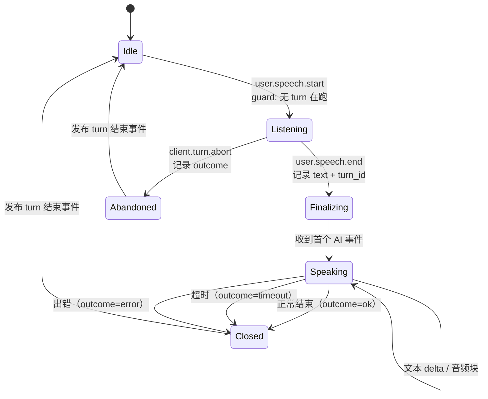

# 语音链路重构设计 1/3：接口与状态机

**系列**：`96_`（架构）→ **`97_`（本文）** → `98_`（防水与迁移）
**状态**：设计，未动代码。

---

## 一、L2 传输层：`DuplexTransport`

**签名里的每一个词都是承诺**——它不知道帧名、不知道 turn、不知道救援。

```go
// DuplexTransport 是一次与语音供应商的双向会话。
//
// 它只负责"把上行音频送出去、把下行事件拿回来"。
// 它不知道 turn 是什么，不知道帧长是多少，也不知道谁会消费这些事件。
type DuplexTransport interface {
    // Open 建立会话。cfg 里的每个字段都来自配置，不是一个都不能少。
    Open(ctx context.Context, cfg TransportConfig) (DuplexConn, error)
}

type DuplexConn interface {
    // SendAudio 送一段上行 PCM。格式由 TransportConfig 声明，不由这里推断。
    SendAudio(ctx context.Context, pcm []byte) error
    // Recv 阻塞直到下一个中性事件。返回值没有帧名，只有语义。
    Recv(ctx context.Context) (TransportEvent, error)
    // Close 幂等。
    Close(ctx context.Context) error
}

// TransportEvent 是供应商事件的中性表示。**这里出现的名字只有这几个**，
// 供应商新增事件类型时，只改适配器。
type TransportEvent struct {
    Kind      EventKind      // AudioOut / TextDelta / TurnDone / Error / Unknown
    Audio     []byte         // Kind=AudioOut，供应商原始采样率
    Text      string         // Kind=TextDelta
    Outcome   string         // Kind=TurnDone
    Raw       string         // 日志与排障
}
```

### 关键决定：采样率转换放在 L2 内部

现状：`frameAudio` 里"重采样 + 切帧 + 编号"三件事写在一起（`94_` F5）。

设计：`TransportConfig` 声明**双方格式**，适配器负责把供应商的格式转成
`ClientFormat`。L3 拿到的音频永远是客户端格式。

```go
type TransportConfig struct {
    ClientFormat AudioFormat // 客户端播放格式（16k/mono/s16le）
    VendorFormat AudioFormat // 供应商输出格式（24k/…），由适配器填
    ...
}

type AudioFormat struct {
    SampleRate int
    Channels   int
    BitsPerSample int
}

// BytesPerMS 让帧长成为推导值，不是常量。
// 现状的 `RescueAudioFrameBytes * time.Millisecond / 32` 里那个 32 就是
// "每毫秒 32 字节"的隐式知识，采样率一变就错。
func (f AudioFormat) BytesPerMS() int {
    return f.SampleRate * f.Channels * f.BitsPerSample / 8 / 1000
}

// FrameBytes 让"100ms 一帧"这个决定只有一处。
func (f AudioFormat) FrameBytes(ms int) int { return f.BytesPerMS() * ms }
```

---

## 二、L3 会话层：`Turn` 状态机



### 2.1 允许的迁移（白名单，不是"其他都拒"）

```go
// transitions 是唯一的合法性来源。状态机不接受表里没有的迁移，
// 并且**记录**被拒的迁移——它们是真机 bug 的第一手证据。
var transitions = map[State][]State{
    StateIdle:       {StateListening},
    StateListening:  {StateFinalizing, StateAbandoned},
    StateFinalizing: {StateSpeaking, StateClosed},
    StateSpeaking:   {StateClosed},
    StateClosed:     {StateIdle},
    StateAbandoned:  {StateIdle},
}
```

### 2.2 turn id 在这里确定一次

```go
// onEnterListening 确定这个 turn 的身份。之后所有出口都从这里取。
// 回落规则只有这一处：客户端给了就用，没给就用会话 id。
func (t *Turn) onEnterListening(ev SpeechStart) {
    t.ID = firstNonEmpty(ev.TurnID, t.sessionID)
    t.startedAt = t.clock.Now()
}
```

**判据**：全仓不应再有第二处 `firstNonEmpty(…, sessionID)` 作为 turn id 的回落。

### 2.3 状态与超时集中声明

```go
type TurnTimeouts struct {
    // 从 user.speech.end 到第一个 AI 事件的预算。
    // 现状是散在 collectTurn 里的等待，单位与语义不同源。
    FirstEvent time.Duration
    // 整轮的上限（B15）。
    Total time.Duration
    // 用户说话中的静默窗口（救援用），这里只声明，由特性层消费。
    Silence [3]time.Duration
}
```

**为什么放一起**：这些值是**同一个产品决策**的五个侧面（"一轮最多等多久"）。
现状它们分布在 `silence_detector.go`、`collectTurn` 的 wait 参数、`idleTimeout` 里，
改一个很难想到另一个。

---

## 三、`Utterance`：音频与文本的统一出口

```go
// Utterance 是"某人在说一段话"的完整表示。生产它的人有两位：
// AI（来自供应商）与救援梯子（来自 app-server）。
// 消费它的人只有一位：会话层的发送路径。
type Utterance struct {
    ID     string          // turn id（3.3 的唯一来源）
    Kind   UtteranceKind   // AI | Ladder —— 决定失败策略，不影响线格式
    Format AudioFormat     // 帧长由它推导
}

type UtteranceSink interface {
    Start(ctx context.Context, u Utterance) (UtteranceWriter, error)
}

type UtteranceWriter interface {
    Text(delta string) error     // 可多次
    Audio(pcm []byte) error      // 客户端格式；内部按 Format.FrameBytes 切
    Finish(outcome string) error // 写 ai.tts.end 与 ai.turn.end
    Interrupt() error            // 用户开口/打断
}
```

**这一层消掉的东西**（对应 `94_` F4/F5）：

| 现状 | 设计后 |
|---|---|
| `voiceproto.AITTSAudio.Encode()` 与 `encodeAudioFrame()` 两份编码 | 只有 `UtteranceWriter` 一份，内部调 `voiceproto` |
| `audioFrameBytes` 与 `RescueAudioFrameBytes` 两个 3200 | 两者都是 `Format.FrameBytes(100)` |
| 救援自己算发送节奏 | `Audio()` 内部按真实耗时发送（可注入时钟） |
| provider 与救援各自拼 `ai.tts.start/end` | 同一个 writer |

---

## 四、L4 特性层：只订阅，不侵入

```go
// TurnObserver 是特性层接入核心的唯一方式。
// 核心不认识救援、不认识徽章；它只广播事件。
type TurnObserver interface {
    OnTurnStart(ctx context.Context, u Utterance)
    OnTurnEnd(ctx context.Context, ev TurnEnded)
}

type TurnEnded struct {
    ID         string
    Outcome    string        // ok | timeout | error
    UserText   string        // 已解析的最终文本（唯一解析点）
    ServerText string        // 供应商 ASR 兜底
    Duration   time.Duration
}
```

**注意 `UserText` 与 `ServerText` 已经在事件里**——这就是 `94_` F2 的修复：
**文本解析在 L3 做一次**，徽章、救援锚点、上报都从这里取，
不再各自 `json.Unmarshal(data, &end)`。

### 4.1 救援 = 一个观察者 + 一个 `UtteranceSink`

```
救援订阅 TurnEnded(ok) → 开窗
沉默到点 → 生成文本 → sink.Start(Utterance{Kind: Ladder})
          → writer.Text(梯子文本)      → ai.rescue.ladder
          → writer.Audio(合成 PCM)     → ai.tts.*
用户开口 → writer.Interrupt()
```

**关键**：梯子音频走的是**同一个 writer**，因此天然不会回流到"AI 的输出"
那条记账路径——`Kind` 已经在 `Utterance` 上，策略表按它分流（`96_` §4）。
今天那个"梯子喂回救援状态机导致永远停在 level 1"的 bug，
在这套结构里**没有可写之处**。

---

## 五、iOS 侧契约：一个字不改

| 帧 | 现状 | 设计后 |
|---|---|---|
| 全部 | 见 `95_` §六 | **完全相同** |

重构是纯内部的。唯一对 iOS 可见的变化是**行为变好了**（音频不再静默丢失、
turn id 不再有三种形态），而信封不变。
`TestSchemaV1BytesAreFrozen` 与 `TestSchemaV2*` 是这条约束的执行者，不允许改。
