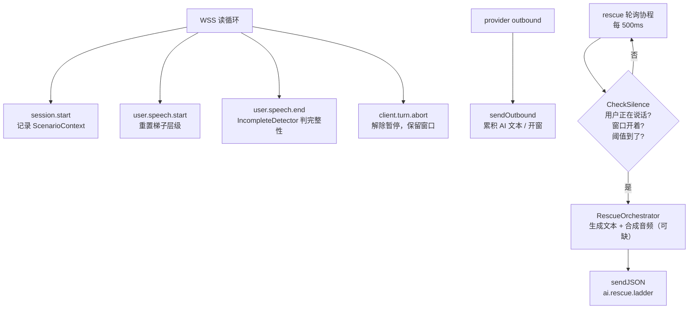

# B8 卡壳救援：handler 集成与测试补全

**标签**: B8 / 语音救援 / 沉默检测 | **模块**: `internal/voicegateway`、`internal/conversation`、`internal/voiceproto` | **深度**: FULL | **状态**: 已解决（handler 集成闭环；音频出口仍缺）
**日期**: 2026-09-16 | **相关文档**: `docs/78_B8_卡壳救援实现方案_2026-09-16.md`

## 3 行速览

- **结论**：B8 的 handler 集成此前只到「接线柱装好了，线没接」—— 检测器没有任何人调用，救援帧没有任何人发送。本次补上轮询、发射、完整性判定、上下文累积四段路径，并修正了一个会让**首要场景永不触发**的时间窗锚点错误。
- **影响**：新窗口语义下，「用户完全不开口」这条路径从"永不救援"变成"3s/6s/9s 逐级救援"。同时**接口语义有变**（`SilenceDetector` 的 `OnUserSpeechStart` 不再重置计时窗口），升级后行为与 docs/78 §5.2 的流程图不一致 —— 那是有意为之，理由见第三节。
- **细读建议**：只想看结论 → 第三节的本质陈述卡 + 第九节的遗留清单；关心设计判断 → 第二节的形成过程。

---

## 一、为什么做

入口是「handler 集成，分析并继续进行，需要补全对应的测试」。动手前先盘了一遍 `git status`，B8 的未提交产物有：

| 文件 | 状态 |
|---|---|
| `internal/conversation/{rescue_generator,incomplete_detector}.go` | 已实现 + 测试 |
| `internal/voicegateway/silence_detector.go` | 已实现 + 测试 |
| `internal/voicegateway/rescue_orchestrator.go` | 部分实现（TTS 是占位） |
| `internal/voiceproto/rescue.go` | 已完成 |
| `internal/voicegateway/handler.go` | **有字段、有 setter，但没有驱动逻辑** |

验收标准（我自己定的，也是这次交付的口径）：**从 WSS 客户端视角，沉默满阈值必须真的收到 `ai.rescue.ladder`**，而不只是「编译过、单测过」。

---

## 二、形成过程

### 起点认知：以为只差一个 ticker

第一遍读 handler.go 的 diff，看到 `SetRescueComponents`、`sessionRuntime.silenceDetector`、`sendOutbound` 里监听 `ai.tts.end` 的钩子、`handleControl` 里 `user.speech.start` 的重置 —— 结构都在。naive 的判断是「缺一个 500ms 的 ticker，加上就完事」。

### 岔路口：把「谁在调用」追了一遍

按 `docs/78 §6.2` 的待办逐条对代码，发现不是缺一段，是缺**四段**：

| 缺口 | 后果 |
|---|---|
| 没有 ticker | `CheckSilence` 除了测试没有任何调用方 → 整个特性是死代码 |
| 没有发射路径 | `GenerateAndSynthesize` 的返回值没有任何地方 `sendJSON` |
| `user.speech.end` 没接 | `IncompleteDetector` 写好了但没人用，docs/78 §5.3 case 1 无法成立 |
| 无对话上下文累积 | `ConversationContext` 三个字段永远是空的 → level 3 只能产出通用句 |

还发现一处更像 bug 的东西：`OnAISpeechEnd()` 记录了 `lastAISpeechEnd`，但 `CheckSilence` **从头到尾没读过这个字段**。一个被写了、被赋了值、从未被使用的字段，通常说明「原本的设计意图和落地实现之间断了」。

### 被推翻的想法：窗口不该开在 `user.speech.start`

顺着那个死字段追下去，才是这次真正的发现。

docs/78 §5.2 的流程图把窗口开在 `user.speech.start`（用户开始说话）。而 §1.1 引用的 PRD 评审原话是：

> 沉默 ≥3s 意味着：(1) **听不懂问题**；(2) 不知道怎么说；(3) 陷入焦虑。

**第 (1) 种用户不会发 `user.speech.start`。** 他没听懂，所以什么也不说。窗口开在 `user.speech.start` 上，恰好把 PRD 认定的首要场景排除在救援之外 —— 特性覆盖率最大的那块是空的。

于是改成：窗口由 **AI 说完话**（`ai.tts.end` / `ai.turn.end`）开启，因为那一刻才是「发言权交到用户手上」。

改完之后 `§5.3 case 1` 又对不上了：文档要求用户说了半句（"I think"）之后继续从原锚点计时，但旧实现里 `user.speech.start` 会把窗口重设 —— 两条要求互斥。

最终裁定（也是写进 `SilenceDetector` 类型注释的版本）：

- `user.speech.start` → **重置梯子层级，但不移动窗口**。用户重新开口配得上一条全新的梯子；但半句话不能白赚 3 秒。
- `user.speech.end(complete=true)` → **关闭**窗口，而不是重开。用户答完了，球在 AI 这边，此时若重开窗口，AI 还在准备回复时就会捅出提示音。
- `user.speech.end(complete=false)` → 保留窗口继续爬梯。

这个版本同时满足 §5.3 case 1、case 2 与 PRD 的「用户开口则重置」，代价是与 §5.2 的流程图字面不符。

### 一句话总结

> 这个特性的形状是「AI 闭嘴之后的那段空白」，不是「用户开口之后的那段空白」。一字之差，覆盖面差一半。

**（记于修正后 10 分钟）** 这个判断是在读 `lastAISpeechEnd` 死字段时掉头转向的，不是一开始就有的 —— 起点认知是错的。

---

## 三、本质分析：窗口锚点开错了地方

### 本质陈述卡

**一句话**：救援窗口锚定在 `user.speech.start`，而该事件在「用户完全不开口」时不发生，于是触发条件与它的目标场景互斥。

**因果链**：

```
因为 检测窗口只由 user.speech.start 开启（silence_detector.go:35）
  → 导致 未开口的用户永远不会让 CheckSilence 的 lastUserSpeechStart 脱离零值，
         函数在 `if d.lastUserSpeechStart.IsZero() { return false, 0 }` 处直接返回
  → 产生 PRD §8.2 认定的首要卡壳场景（听不懂问题 → 沉默）零救援，
         实测表现为「接上 WSS 什么都不说，等到天荒地老也没有 ai.rescue.ladder」
```

**边界**：
- 必然发生：用户从 `ai.tts.end` 到会话结束一次 `user.speech.start` 都不发。
- 不会发生：用户先说了半句再沉默 —— 这条路径旧实现反而是通的，所以这个 bug 在「用户至少开了口」的手测里看不出来。

**层级**：③ 根因（不是触发条件 —— 触发条件是"用户沉默"，机制是"CheckSilence 提前返回"，让它得以成立的是"事件选择"）。

**代码定位**：`internal/voicegateway/silence_detector.go:52`（旧版 `if d.lastUserSpeechStart.IsZero()` 短路）；事件选点在 `handler.go` 的 `TypeUserSpeechStart` 分支。

**解释力自查**：
- 能解释：为什么三条单测全绿而特性实际不可用（单测都先手工调 `OnUserSpeechStart`）；为什么没人发现（`lastAISpeechEnd` 被赋值说明作者想到了这个场景，但没接上）。
- **解释不了**：如果存在某个客户端在用户全程沉默时也发 `user.speech.start`，那危害就被掩盖了。**这一条我没有验证** —— 需要 iOS 侧确认 VAD 的事件语义。

**可切换性验证**：双向都做过。移除锚点限制（把窗口改由 `ai.tts.end` 开启）→ 新增的 `TestHandler_Rescue_SilentUserReceivesWholeLadder` 转绿；把旧逻辑加回 → 该测试必然超时失败（因为没有任何东西会触发）。

**反例**：一个先开口、说半句、再沉默的用户。旧实现在这条路径上是**正常**的，所以这不是「整个特性没实现」，而是「特性在最大的那块场景上没有生效」。

**复核提示**：若 iOS 确认「沉默时也会发送 `user.speech.start`」（例如长按即开始录音），则本条危害降级为「不必要的耦合」，但新锚点仍然更正确 —— 不必回退。

**置信度: 高** | **如果我错了，会怎么发现**：`TestHandler_Rescue_SilentUserReceivesWholeLadder` 与 `TestHandler_Rescue_AITTSEndAloneOpensTheWindow` 会失败；或在真实会话里观察「用户全程沉默的 session 从未出现 `rescue_ladder_emitted` 日志」。

---

## 四、本质分析：阈值默认值塌缩（测试抓到的第二个 bug）

修完之后跑新测试，`TestSilenceDetector_ThresholdSpacingIsThreeSeconds` 直接报：

```
silence_detector_test.go:102: rung 2 fired at 3.1s, want 6s
silence_detector_test.go:102: rung 3 fired at 3.2s, want 9s
```

旧实现的 `withDefaults` 只做单调钳制，不填默认值：

```go
if t.Level1 <= 0 { t.Level1 = DefaultRescueLevel1After }  // 3s
if t.Level2 < t.Level1 { t.Level2 = t.Level1 }             // 0 < 3s → 被抬成 3s
if t.Level3 < t.Level2 { t.Level3 = t.Level2 }             // 0 < 3s → 被抬成 3s
```

三层梯子塌成一瞬间，用户会在 3 秒内被连灌三句提示。**这是"钳制"被当成了"填默认值"** —— 根因是「不变量维护」和「缺省填充」两件事共用了同一个 if 序列，而它们的方向相反：填充是"从默认值往上"，钳制是"从下界往上"。修法是先逐个填默认，再整体做单调钳制。

**置信度: 高** | **如果我错了，会怎么发现**：三级梯子在 1 秒内连续到达（日志里三条 `B8 rescue ladder emitted` 的 ts 差 < 1s）。

**附带教训**：这条 bug 只在**走默认阈值**（生产路径）时出现，而当时所有单测都显式传 `now` 但**没检查阈值本身**。测试要覆盖"构造参数"，不只要覆盖"行为"。

---

## 五、方案全貌



**数据结构**：`sessionRuntime` 新增 10 个字段（检测器、编排器、tick、时钟、WaitGroup、busy 标志、停止 channel、上下文互斥锁、`ConversationContext`、当前 turn_id）。字段全部挂在 `sessionRuntime` 而不是 `Handler`，因为除了 tick 间隔和编排器，其余都是**每会话**状态。

**边界**：
- 窗口内每级只触发一次，三级用尽后不再打扰（等 B15 的 turn timeout 自然收口）。
- 用户说话中一律不触发。
- AI 回合以 `timeout` / `error` 结束 → **不开窗**。B15 的 30s 超时正好落在这条路径上，且它到达时梯子早已用尽；不挡的话，一个已经超时的回合会在 33s 起被重新唠叨 —— 而唠叨正是这个特性要消灭的东西。
- 未接线（`SetRescueComponents` 没调）→ `rescueEnabled()` 为假，逐字节等价于 B8 存在之前。

---

## 六、落地要点

| 文件 | 改动 | 说明 |
|---|---|---|
| `silence_detector.go` | 重写 211 行 | 窗口锚点改 `ai.tts.end`；新增 `OnUserSpeechEnd(complete)`；阈值可配 + 单调钳制；`CheckSilence` 改为**升序**返回最低未触发档 |
| `handler.go` | +135 / −5 | 接线柱、`Options.RescueTick`、`loop` 启停轮询、`close` 收口、`sendOutbound` 钩子、`session.start` 记场景；删掉 `writeProviderOutbound` 里那段空转的 B8 死代码 |
| `handler_rescue.go` | 新增 345 行 | 所有 rescue 方法集中一处，避免 handler.go 继续膨胀 |
| `rescue_orchestrator.go` | 重写 191 行 | `orchestrator.Client` → `RescueSynthesizer` 接口；合成失败/未配置均降级为纯文本梯子 |
| `handler_rescue_test.go` | 新增 724 行 | 12 条 handler 级集成测试，**假时钟**驱动 |
| `silence_detector_test.go` | 重写 316 行 | 14 条，含默认值/钳制/升序不跳档 |
| `rescue_orchestrator_test.go` | 重写 289 行 | 10 条，含 nil 合成器与合成失败两条降级路径 |
| `voiceproto/frames.go` | +11 行 | 新增 `TurnOutcome*` 常量（此前只有注释里列了字面量） |

### 两个实现细节值得单独说

**1. 检测器每会话克隆。** `SetRescueComponents` 收到的检测器只当作**阈值模板**。原因：一个检测器带一个活窗口，两个并发会话共用一个窗口，A 的 `ai.tts.end` 开的窗会被 B 的 ticker 花掉，A 的梯子送到 B 手上。`loop` 里 `NewSilenceDetectorWithThresholds(template.Thresholds())` 克隆，并由 `TestHandler_RescueDetectorIsPerSessionAndLeavesTheTemplateAlone` 钉住。

**2. busy 检查必须在 `CheckSilence` 之前。** `CheckSilence` 返回即消费该档（置 `rescueLevel`）。如果先问再查在途标志，每次生成与 tick 重叠就会**永久丢一档**；而重叠是常态 —— 慢模型生成一次可能超过 3s 的档间隔。所以顺序是「在途就整个跳过，下次 tick 再问」。

---

## 七、接口变更（面向调用方）

```go
// 旧
OnUserSpeechStart(now time.Time)          // 开窗 + 重置
CheckSilence(now time.Time) (bool, int)
OnAISpeechEnd()                          // 无参数，且 lastAISpeechEnd 从未被读

// 新
OnAISpeechEnd(now time.Time)             // 开窗
OnUserSpeechStart(now time.Time)         // 只重置梯子层级，不动窗口
OnUserSpeechEnd(now time.Time, complete bool)
Thresholds() RescueThresholds
```

`RescueOrchestrator` 的构造签名同步变化：`NewRescueOrchestrator(gen, synth RescueSynthesizer, logger)`，不再吃 `orchestrator.Client`（那个字段此前只被存起来，从未用过）。

**回退方式**：本次全部为**新增**文件或未提交状态下的改动，`git checkout internal/voicegateway/silence_detector.go internal/voicegateway/rescue_orchestrator.go internal/voicegateway/handler.go` 并把新文件删掉即可；未接线时行为与改动前一致，所以生产风险为零。

---

## 八、取舍与代价

| 取舍 | 代价 | 何时该重新考虑 |
|---|---|---|
| 与 docs/78 §5.2 流程图不符（窗口开在 AI 结束而非用户开口） | 文档需同步更新，否则下一个人会照图改回去 | 已在本次同步 docs/78 |
| 检测器按模板克隆 | 调用方拿不到「那个会话的检测器」，只能看 `ai.rescue.ladder` 帧 | 若将来需要运行时可观测面板 |
| `RescueSynthesizer` 留空实现 | 生产现在是**纯文本梯子**（`audio_url` 为空） | 见第九节遗留 |
| TTS 未接，未引入 `orchestrator` 的 LLM 适配器 | 打开特性的成本略高 | 若 W5 决定配 Ark 凭证 |

> **没有做的取舍**：没有把 `synthesizeTTS` 占位实现成「调用 TTS Router」。原因是 `internal/content/tts` 自己带着 "built, not turned on" 的告警、住在 app-server 进程里、且内部端点回的是 base64 分片而不是 URL。硬凑一个 `https://tos.volcengineapi.com/rescue/<turn>.mp3` 交给 iOS，等于把一个必然 404 的地址发出去 —— 比不发更糟。

---

## 九、验证与交付

### 已验证（本机，全部通过）

```
go build ./...                                    OK
go test ./...                                     OK（全仓无失败）
go test -race ./internal/voicegateway/... \
        ./internal/conversation/...               OK
go vet ./internal/voicegateway/...                OK
gofmt -l internal/voicegateway internal/voiceproto  无输出
```

B8 相关测试 **36 条全绿**（`TestSilenceDetector*` 14 + `TestRescueOrchestrator*` 10 + `TestHandler_Rescue*` 12）。

handler 级测试用**假时钟**驱动，而不是 sleep：三条档位 50/100/150ms，tick 5ms。这样「9 秒梯子」是一个断言而不是一次等待，负向用例（"不该收到梯子"）也在**时钟冻结**下成为构造上的必然 —— 不与时序赛跑。

覆盖的关键路径：
- 用户全程沉默 → 收到 level 1/2/3，此后不再打扰
- 仅 `ai.tts.end` 开窗 / 仅 `ai.turn.end` 开窗（mock、dev-echo 只有后者）
- 用户答完整 → 不救援；用户说话中 → 不救援
- 半句话（"I think"）→ 从原锚点继续，3s 触发
- `client.turn.abort` → 解除暂停，梯子保留
- 回合 outcome=timeout/error → 不开窗；partial → 开窗
- 未接线 → 全程无梯子
- 检测器每会话独立、模板不被污染
- 生成器确实拿到 `ScenarioContext` 与 AI 末句

### 未验证（明确分开列）

| 未验证项 | 为什么 | 交给谁 / 在哪跑 |
|---|---|---|
| 真实 volc-duplex 会话下的端到端救援 | 本机没有可用凭证与上行链路 | 走 `cmd/integration-voice-gateway` 或 staging，由 W5 联调 |
| `user.speech.start` 在 iOS 沉默时是否真的不发 | 属客户端行为 | **iOS 团队确认**（决定第三节「解释不了」那一栏） |
| iOS 对 `ai.rescue.ladder` 的解析与播放 | 协议新增，客户端未实现 | Phase 5 联调清单（docs/78 §6.5） |
| 真实 LLM 生成质量（三档内容是否可用） | 生成器测的是 mock，不是 Ark | 需先接 Ark 凭证 |
| 音频可用性 | 见第八节 | B17 TTS 启用决策（docs/54） |

> 判据提醒：本次所有结论的证据都是「测试通过」。测试覆盖的是**网关的行为契约**，不是**端到端体验**。第九节上表之外的部分，置信度上限是「中」。

---

## 十、下一步与遗留

1. **TTS 音频出口**（阻塞「用户听得见」）：需要 app-server 暴露一个「网关可用、返回可播放 URL」的合成接口，或网关自己落音频并签发 URL。当前 3 条档位参数（`RescueVoiceSpeed=0.9` / `RescueVoiceVolume=0.85`）已作为常量放在 `RescueSynthesizer` 旁待用。
2. **`cmd/voice-gateway/main.go` 接线**：`SetRescueComponents` 是现成的开关，但需要给网关配 Ark 凭证（当前 `voicegateway.Config` 没有 Ark 相关字段），以及一个 `orchestrator.Client → conversation.LLMClient` 的适配器（约 20 行）。**刻意没做** —— 在没有音频出口的情况下把它打开，只会让用户看到不会出声的提示气泡。
3. **`docs/78 §5.2 / §5.3` 流程图同步**（本次已改 §5.2 前的语义说明，§5.3 case 1 无需改）。
4. **埋点（Phase 4）**：`first_stuck_rescue_triggered` / `rescue_ladder_emitted` 目前只有结构化日志，尚未接入埋点通道。

---

## 修订记录

（暂无。本质陈述卡的「解释不了」一栏若被 iOS 侧推翻，在此追加而不删除原文。）

## 相关手记

- `2026-09-16-b8-rescue-handler-integration.md`（本篇）
