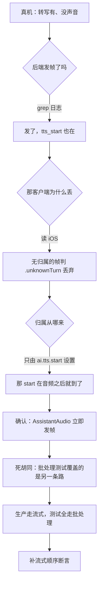

# 装了接线柱，却把线接到了开关后面：生产语音静音 + 状态机在数自己的帧

**标签**: 语音网关/TTS | **模块**: `internal/voicegateway` | **深度**: FULL | **状态**: 已解决
**日期**: 2026-09-20 | **相关文档**: `docs/94_`–`docs/101_`、`docs/98_ §七`、`docs/99_`、iOS `docs/70_tts_wss_refactor/`

## 3 行速览

- **结论**：两处"组件齐全、测试全绿、唯独接线接错"的缺陷。`ai.tts.start` 被放在回合末尾发，落在它所引出的音频之后（客户端丢掉全部音频 = 静音）；turn 状态机的结束事件被救援开关挡住，生产默认配置下**每一轮干净会话都被计成客户端协议违规**。
- **影响**：生产 `volc-duplex` 路径助手静音（转写正常）；`docs/101_` 告诉真机测试者"每轮看到 `turn_transition_rejected` 说明客户端变了"——那个信号是网关自己造的。
- **细读建议**：只要结论看「四、本质陈述卡」；想看这两个缺陷为什么能同时躲过两侧全部测试，看「三、排查路径」。

---

## 一、现象

**真实报错原文**（本机复现，非转述）：

```
--- FAIL: TestCleanTurnsProduceNoRejections/rescue=false
    a clean two-turn session reported protocol violations:
    map[user.speech.start:1 user.speech.end:1]
--- FAIL: TestCleanTurnsProduceNoRejections/rescue=true
    a clean two-turn session reported protocol violations:
    map[ai.turn.end:2]
--- FAIL: TestStreamedAudioIsPrecededByTTSStart
    ai.tts.start at [3] follows the first audio frame at [0] — the stream is
    opened after the audio it introduces, so the client discards the reply
```

设备侧的对应信号：转写正常、`tts_start` 有日志、**没有声音**（除一个被截断的尾帧）。

**最小复现**：把 `handler_rescue.go` / `provider_volc_duplex.go` 的修复各自撤掉即可——两条都是在写测试时**先验证过"改回旧行为即失败"**（见「四、可切换性验证」）。

## 二、第一直觉与它的偏差

> **必填。**

**我一开始以为是 iOS 的问题。** 理由看起来很硬：后端一直在发帧，客户端没声音，那不就是客户端没播吗。

**实际是两边的三处改动凑成了一个静音**，其中后端的顺序问题才是主因：

| 改动 | 单独看是否合理 | 合起来 |
|---|---|---|
| 后端 `3cb3774`"always send `ai.tts.start` before audio frames" | 是——iOS 现在要求帧有归属 | 提交说明与注释都写 `before any audio frames`，代码却把它放在 `turnToOutbound`，而流式路径上音频早就走光了 |
| 后端 M1/M2 的流式改造 | 是——那是 P1-2"让助手早点开口" | 音频改成"一产出就发"，于是**回合末尾**的 start 必然落在音频之后 |
| iOS `d004869` 删掉 legacy 回退 | 是——但**同一窗口**删掉了唯一的兜底 | 无归属的帧从"漏到 `audioEngine.play` 还能出声"变成"一律丢弃" |

**偏差的核心**：我盯的是"哪一侧坏了"，而真正的问题是**接缝上的时序契约**——它没有任何一侧的测试在看。`3cb3774` 的意图是"start 要在音频之前"，但既没有测试断言这个顺序，注释里那句"before any audio frames"就成了唯一记录，而它是错的。

## 三、排查路径



**死胡同值得单说**：`TestVolcDuplexForwardsAssistantAudioAsBinaryFrames` 看起来正是在验这条路径——它构造了真 duplex stub、真音频、真 resample。但它的 session **没有装 emitter**，于是 `AssistantAudio` 直接 return，音频全走 `turnToOutbound` 的批处理分支。**批处理分支的顺序一直是对的**（start 在 audio 之前追加），所以这条测试在缺陷存在期间稳定通过。同理，DevEcho 的 `emitMockTTSTurn` 也是先 start 再音频——**唯一验过的路径，是唯一没这个 bug 的路径**。

同一条链路上查出的第二个缺陷（`turn_transition_rejected` 每轮都报）：它的排查是纯 grep 调用方，见下。

## 四、本质陈述卡

> 「本质」只写第 ③ 层。①②进排查路径，④进沉淀。

- **一句话**：**组件的"存在"被验证了，"被以正确的顺序、从正确的来源调用"没有——而后者才是接缝的契约。**
- **因果链**：
  ```
  因为 契约的两个属性（帧的先后顺序、事件的施加来源）都没有断言
    → 导致 start 位置写反、状态机被功能开关挡住，两者都无人发现
    → 产生 静音与"每轮都报客户端协议违规"两个反向信号
  ```
- **边界**：
  - 必然发生：走流式路径（装了 emitter）的 `volc-duplex` 回合，助手音频 100% 被丢
  - 不会发生：批处理路径（无 emitter）、DevEcho mock 路径——它们的顺序本来就对
- **层级**：① 触发条件 = iOS 改为"无归属即丢弃" / 生产默认救援关闭 · ② 机制 = start 追加在回合末尾、`EvAIEnd` 只在救援分支施加 · **③ 根因 = 契约属性没有可执行的断言，只有注释** · ④ 系统性原因 = 见「七」
- **代码定位**：
  - `internal/voicegateway/provider_volc_duplex.go:276-300`（立即发帧）与 `:933-950`（回合末尾发 start）
  - `internal/voicegateway/handler_rescue.go:243-245`（`if !rt.rescueEnabled() { return }` 挡住了整个状态机）
  - 客户端侧：`TTSPlaybackCoordinator.swift:136-143`
- **解释力自查**：
  - 能解释：为什么两侧单测全绿；为什么真机（走 DevEcho）验过了却没发现；为什么"信号反转"（网关数自己的帧）
  - **解释不了的**：解释不了 2026-09-12 那次**方向相反**的事故——那时是客户端把帧交给了一个只记录不播放的解码器，属于"接上了但接的是空壳"。同一接缝，两种故障方向，说明这里的契约从未被写清楚过，不只是没人测。
- **可切换性验证**（双向，均实测）：
  - 移除 → 消失：把 `startTurn` 置 false（还原"回合末尾发 start"）→ `TestStreamedAudioIsPrecededByTTSStart` 失败
  - 加回 → 复现：把 `NoteAIEnd()` 换回 `applyTurnEvent(EvAIEnd)` → `map[ai.turn.end:2]`；把状态机重新挡回救援开关后 → `map[user.speech.start:1 user.speech.end:1]`
- **反例**：**批处理路径就是反例**——同一个 provider、同一份代码、同样的 iOS 客户端，因为 start 与音频同在 `turnToOutbound` 里追加，顺序天然正确，从不静音。它证明问题不在"发不发 start"，而在"发在什么时候"。
- **复核提示**：本结论依赖"生产走流式路径"（`voiceduplex/volc_duplex.go:695` 收到 `response.output_audio.delta` 时立即转发）。若供应商改成回合末一次性产出，流式分支不再被走到，本结论的触发条件随之消失——但**契约仍然需要断言**，否则换回流式会原样复发。
- **置信度**：高 | **如果我错了，会怎么发现**：真机跑一次 `volc-duplex`，日志里 `tts_frame_dropped reason=unknownTurn` 非零而 `tts_first_audio` 不出现，即为复发。

## 五、修复方案与取舍

| 文件 | 改动 | 影响面 |
|---|---|---|
| `provider_volc_duplex.go` | start 移到 `AssistantAudio` 首帧之前（用现成的 `first := !s.streamedAudio` 判定）；新增 `ttsStarted` 防重复；被打断的回合不发 | `volc-duplex` 生产路径 |
| 同上 | 抽出 `ttsStartFrame()` 单一构造，两个发射点不再各写一份字段 | 防止两处描述的流不一致 |
| `turn.go` | 新增 `NoteFirstOutput()` / `NoteAIEnd()`，幂等 | 状态机语义 |
| `handler_rescue.go` | 状态机部分移出 `rescueEnabled()` 约束；`noteAITurnEnd` 只保留救援职责 | 所有会话（不只是开救援的） |

**取舍**：被打断的回合不再发 start。代价是客户端收到一个没有 start 的 `ai.tts.end`——已确认 iOS 的 `onEnd` 对未注册轮次是容忍的（置 nil，不报错）。换来的是不再把客户端已标 `superseded` 的轮次重新激活（与 P0-11 同类的潜在漏音）。

**回退方式**：两处修复各自独立，`git revert` 即可；但回退状态机那处会恢复"每轮误报"，回退 start 那处会恢复静音。

## 六、验证

怎么确认是**真好了**，而不是**没触发**：

- `TestStreamedAudioIsPrecededByTTSStart`：走**流式**路径（装了 emitter），断言整个线上 start 恰一次且先于首帧——即"没触发"不可能通过，因为音频确实在流上。
- `TestCleanTurnsProduceNoRejections`：救援开/关两种配置各跑两轮完整帧序列，断言 `Rejected()` 为空。**这是关键**：它不看组件，看的是"网关实际喂进去的东西"。
- `TestAIOutputOutsideATurnIsStillCounted`：确认幂等没有把真异常一起吞掉。
- 两处修复都做了"改回旧行为即失败"的双向验证（见本质陈述卡）。
- `./scripts/dev-check.sh` 全绿；`go test ./...` 全绿。

**未验证**（必须与上一栏分开列）：

| 未验证项 | 为什么 | 交给谁 / 在哪跑 |
|---|---|---|
| 真机 `volc-duplex` 出声 | 需要真设备、真供应商链路 | 真机验证，按 `docs/101_`（已修正的版本） |
| 静音是否**只**由这两个缺陷造成 | 尾帧被截断之类的次要现象没单独归因 | 同上；设备日志看 `tts_first_audio` 是否出现 |
| 被打断回合不发 start 对客户端的实际影响 | 只从代码确认 `onEnd` 容忍，没跑过 | 真机 barge-in 场景 |

## 七、沉淀

- **可迁移教训**：一个契约属性如果只写在注释里，它就不是契约，是愿望。`3cb3774` 的注释准确描述了**意图**（`before any audio frames`），提交说明也是，唯独代码不是——而评审读的是说明和注释。**顺序、次数、来源这三类属性必须落到断言上**，因为它们都看不见、且两侧各自的单测天然覆盖不到。
- **防复发措施**：
  - `assertTTSStartBeforeAudio` + `TestStreamedAudioIsPrecededByTTSStart`（顺序）
  - `TestCleanTurnsProduceNoRejections`（来源与次数：驱动真实装配，断言零拒绝）
  - `TestAIFirstOutputReachesSpeaking`（可达性：不可达的状态与不存在的状态无法区分）
- **已登记进 `README.md` 规则表**：#6 的第 4 例（见下）

### 这是规则 6 的第 4 例，所以按硬规则必须产出防护

规则 6 的表里记了三例（B8 接线、B7 回写、客户端 envelope）。**这次是第 4 例，而且是最纯的一例**——`Turn` 状态机有完整实现、完整单测，`EvAIFirstOutput` **一个生产调用点都没有**，规则 6 的 grep 方法照常一击即中（命中数 0）。按硬规则"同一坑第二次必须产出防护，而不是再写一篇手记"，本次真正的交付是上面那两条测试，不是这篇文档。

## 修订记录

<暂无。本结论依赖"生产走流式路径"，复核提示见本质陈述卡。>

## 相关手记

- `2026-09-16-b8-rescue-handler-integration.md`（规则 6 的第 1 例；同一类"组件齐全但没接线"）
- `2026-09-17-silent-fields-and-dead-scheduler.md`（第 3、4 例；"有字段没写入方"）
