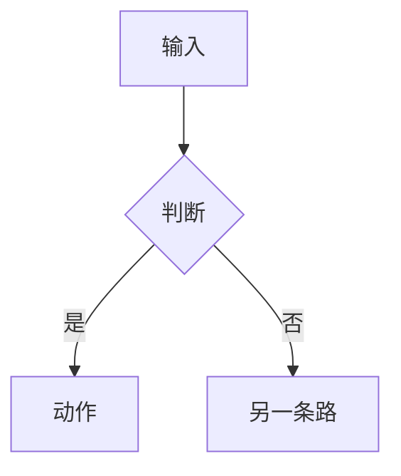
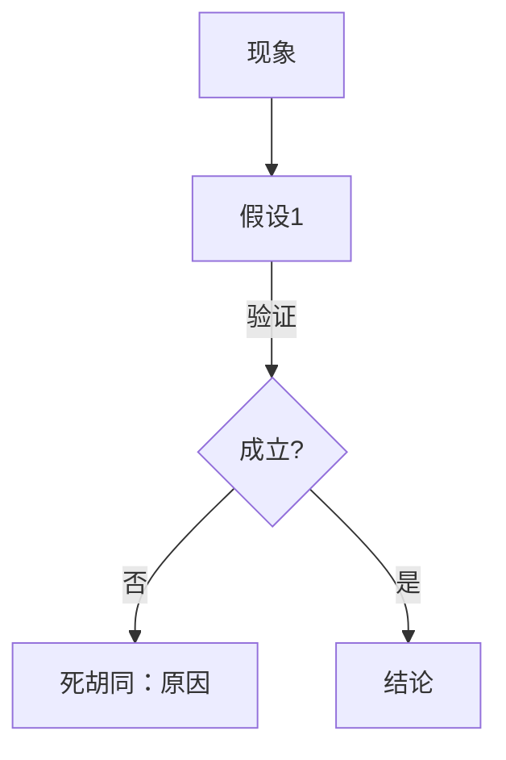

# <一句话标题>

**标签**: <模块/特性> | **模块**: <路径> | **深度**: BRIEF / FULL | **状态**: 进行中 / 已解决 / 未解决 / 已废弃
**日期**: YYYY-MM-DD | **相关文档**: <docs/xx_...>

## 3 行速览

- **结论**：<一句话说清结果>
- **影响**：<谁会受影响、行为怎么变>
- **细读建议**：<只想看结论看哪节；关心判断看哪节>

---

## 任务 / 功能型骨架

### 一、为什么做

<来源（谁提的 / 哪份文档哪一节）、目标、可观测的验收标准>

### 二、形成过程

> 这一节是全文最值钱的部分，也是 ADR 没有的部分。

- **起点认知**：<一开始以为是什么>
- **岔路口与代价**：<在哪发现和以为的不一样，当时有哪几条路，各要付什么>
- **被推翻或修正的想法**：<原来的判断是什么，为什么站不住>
- **一句话总结**：<就一句话>

### 三、方案全貌



- **数据结构**：<新增/变更的字段与类型>
- **边界**：<会发生 / 不会发生>

### 四、落地要点

| 文件 | 改动 | 说明 |
|---|---|---|
|  |  |  |

### 五、取舍与代价

| 取舍 | 代价 | 何时该重新考虑 |
|---|---|---|
|  |  |  |

### 六、验证与交付

**已验证**（<环境>）：<命令与结果>

**未验证**（必须与上一栏分开列）：

| 未验证项 | 为什么 | 交给谁 / 在哪跑 |
|---|---|---|
|  |  |  |

> 判据：如果一条结论的全部证据只是「能编译」，它的置信度上限就是「中」。

### 七、下一步与遗留

1. ...

---

## Bug 型骨架

### 一、现象

**真实报错原文**：

```
<粘贴原文，不要转述>
```

**最小复现**：

```bash
<命令>
```

### 二、第一直觉与它的偏差

> **必填。** 这一栏说清「我一开始以为是 X，实际是 Y，偏差在哪里」。

### 三、排查路径

用 `flowchart TD` 画分支，死胡同也要写并说明**为什么此路不通**。



### 四、本质陈述卡

> 「本质」只写第 ③ 层。①②进排查路径，④进沉淀。

- **一句话**：
- **因果链**：
  ```
  因为 <条件>
    → 导致 <机制>
    → 产生 <现象>
  ```
- **边界**（必然发生 / 不会发生）：
- **层级**：① 触发条件 / ② 机制 / **③ 根因** / ④ 系统性原因
- **代码定位**：`文件:行号`（说不出，通常还没到本质）
- **解释力自查**：
  - 能解释：
  - **解释不了的**：<不许写「无」>
- **可切换性验证**（双向）：
  - 移除 → 消失：
  - 加回 → 复现：
- **反例**：<不许写「无」>
- **复核提示**（什么条件下本结论失效）：
- **置信度**：高 / 中 / 低 | **如果我错了，会怎么发现**：<可观测信号>

### 五、修复方案与取舍

| 文件 | 改动 | 影响面 |
|---|---|---|
|  |  |  |

**回退方式**：

### 六、验证

怎么确认是**真好了**，而不是**没触发**：

### 七、沉淀

- 可迁移教训：
- 防复发措施（测试 / 断言 / 类型 / 校验 / 监控）：
- 已登记进 `README.md` 规则表：#N

---

## 修订记录

<本质会过时。被推翻时不删原文，在此追加新证据与认知变化。>

## 相关手记

- `YYYY-MM-DD-xxx.md`（同主题追加 `-2`）
