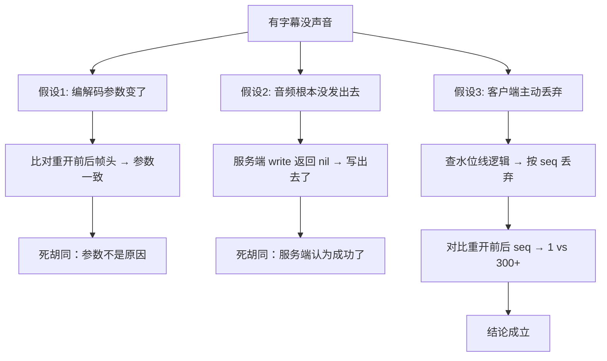

# 【示例·虚构】帧序号重开后退回 1，客户端静默丢弃了整段音频

> ⚠️ **这是一篇填好的虚构范例，用来展示「本质陈述卡」该写到什么颗粒度。**
> 案例本身是编的（细节借用了本仓库的真实形状，便于代入），**不要当作历史事实引用**。
> 看它比看 `_TEMPLATE.md` 快：模板告诉你有哪些格子，范例告诉你每格该填多细。

**标签**: 示例 / 音频序号 | **模块**: `internal/voicegateway`（虚构） | **深度**: FULL | **状态**: 已解决
**日期**: 2026-09-16 | **相关文档**: 无（虚构）

## 3 行速览

- **结论**：重开上游连接时新会话的序号从 1 重新开始，而客户端的丢弃水位线还停在几百 —— 之后每一帧都低于水位线，全被丢掉。
- **影响**：会话后半段的音频**全部消失**，但转写正常（转写不走客户端那道闸），所以表现为「有字幕没声音」，极容易误判成播放器问题。
- **细读建议**：只看第四节本质陈述卡；第五节「死胡同」也很值得看，因为最直觉的那条路是错的。

---

## 一、现象

**观察到的日志**：

```
WARN upstream audio write failed; reopened session (attempt 1/1)
WARN upstream audio write failed  (deduplicated) dedup_count=10
```

**用户侧表现**：整段会话前 20 秒有声音，之后**再没响过**，但字幕一直在更新。

**最小复现**：本地 dev 环境，会话中途 kill 掉上游连接，让它走一次 transparent reopen；打开音频日志观察 `seq`。

---

## 二、第一直觉与它的偏差

我的第一直觉是「重开之后音量/编解码参数变了」，因为现象是"没声音"。

**偏差在于**：问题不在音频内容，而在**帧的编号**。客户端的 barge-in 水位线（`nextAudioSeq` 的丢弃闸门）在整条 WebSocket 生命周期内**不重置** —— 它由 start/stopCapture 清除，从不按轮次清。新会话从 1 开始编号，而水位线已经到 300 多，于是每一帧都落在"已播过"的那一侧被直接丢掉。

我是先看**服务端日志里写成功**、再看**客户端没有收到**，才掉头去查编号的。

---

## 三、排查路径



**两条死胡同为什么不通**：
- 假设 1：参数确实是逐帧带在头部里的，比对结果一致 —— 而且如果参数错了，客户端会报解码错误而不是静默丢弃。
- 假设 2：服务端的 `Write` 返回成功只证明**字节进了 TCP**，不证明对端采纳。这是「写成功 ≠ 被接收」的经典分裂，我在这条上停了大约 15 分钟。

---

## 四、本质陈述卡

- **一句话**：上游重开产生了一个新会话，但客户端的音频水位线是**跨会话**状态，而新会话的序号计数器是**会话内**状态 —— 两个生命周期不一致。

- **因果链**：
  ```
  因为 序号计数器的寿命 = 上游会话，而客户端水位线的寿命 = WebSocket 连接
    → 导致 重开时计数器归零到水位线之下，客户端判定"这是旧帧"并丢弃每一帧
    → 产生 重开之后整段会话的音频缺席，而转写（不经该闸门）照常
  ```

- **边界**：
  - 必然发生：重开发生在**至少一次音频已播出之后**（即水位线已被推高）。
  - 不会发生：重开发生在首帧音频之前 —— 水位线还是 0，归零无害。这解释了为什么本地早期冒烟测试没抓到它。

- **层级**：③ 根因（① 是上游连接断开，② 是客户端按 seq 丢弃，③ 是两套生命周期不一致）

- **代码定位**：`internal/voicegateway/handler.go` 的 `carryAudioSequence`（新增）；`internal/voicegateway/provider_volc_duplex.go` 的序号发号处。

- **解释力自查**：
  - 能解释：为什么"有字幕没声音"（转写不走闸门）、为什么是"后半段全丢"而不是"丢几帧"（水位线之下是全部）、为什么本地冒烟没抓到（那批用例的重开点在首帧之前）。
  - **解释不了的**：为什么线上这个 bug 的报障率远低于重开发生率 —— 我推测部分客户端在重开后重置了自己的水位线，但这**没有验证**，需要 iOS 侧确认。

- **可切换性验证**（双向）：
  - 移除：把 `carryAudioSequence` 拿走 → 单测 `TestReopenCarriesAudioSequence` 立刻失败，且失败模式与线上一致（重开后第一帧 seq=1）。
  - 加回：恢复后该测试转绿；同时手工在 dev 环境重放一次"播过上音频再重开"，音频不再中断。

- **反例**：一个**从没播出过音频**就重开的会话（上游握手后立刻断）。这条路径旧代码是正常的 —— 所以这不是"重开功能坏了"，而是"重开的一部分状态没被接管"。

- **复核提示**：若客户端改为按**轮次**而非按连接维护水位线，本结论失效。

- **置信度**: 高 | **如果我错了，会怎么发现**：dev 环境重开后第二帧的 `seq` 不是 `watermark+1`，或客户端日志里出现 `dropped by watermark` 计数为 0。

---

## 五、修复方案与取舍

| 文件 | 改动 | 影响面 |
|---|---|---|
| `handler.go` | 重开时把旧会话的 `NextAudioSequence()` 交给新会话 | 仅重开路径 |
| `provider_volc_duplex.go` | 暴露 `NextAudioSequence` / `AdoptAudioSequence` | 新增接口，未实现者不受影响 |

**取舍**：用接口断言而不是给所有 provider 加方法 —— 不吃号（mock、dev-echo）的 provider 不该被迫实现一个它不用的东西。

**回退方式**：`git revert <sha>`；未重开时行为不变，生产风险为零。

---

## 六、验证

```bash
go test ./internal/voicegateway/... -run TestReopenCarriesAudioSequence -v   # PASS
go test -race ./internal/voicegateway/...                                    # PASS
```

**怎么确认是真好了而不是没触发**：测试专门先播**若干帧**把水位线推上去再重开（复现的前提），并断言重开后的第一帧 `seq == previous+1`。只断言"重开成功"的测试会漏掉它 —— 那种测试在修复前也通过。

---

## 七、沉淀

- **可迁移教训**：跨两个生命周期（连接 / 会话）的状态，在"会话重建"时必须显式交接。凡是"新对象从默认值开始"，都要问一句**谁还在用旧对象留下的值**。
- **防复发措施**：重开路径的单测必须包含「已产生副作用之后再重开」的前置条件。
- **已登记进 `README.md` 规则表**：见「防复发规则表」对应条目（示例文件不登记）。

---

## 修订记录

（暂无）

## 相关手记

- [2026-09-16-b8-rescue-handler-integration.md](2026-09-16-b8-rescue-handler-integration.md)（真实的一篇，可对照阅读）
